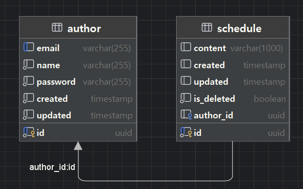

# ⏰ Scheduller with Spring JDBC

## 📜프로젝트 파일 구조
```java
📁com.schedule
├── 📁common
│   ├── 📁config
│   │   ├── AppConfig
│   │   ├── JacksonConfig
│   │   ├── SecurityConfig
│   │   ├── SwaggerConfig
│   │   └── TransactionConfig
│   ├── 📁database
│   │   ├── DatabaseConnection
│   │   └── DatabaseExceptionHandler
│   └── 📁exception
│       ├── BaseException
│       ├── CustomException
│       ├── CustomSQLException
│       ├── ErrorCode
│       ├── GlobalExceptionHandler
│       └── SQLErrorCode
├── 📁controller
│   ├── 📁author
│   │   ├──📁controller
│   │   │   └── AuthorController
│   │   ├── 📁dao
│   │   │   └── AuthorDao
│   │   ├── 📁dto
│   │   │   ├── AuthorRequestDto
│   │   │   ├── AuthorResponseDto
│   │   │   ├── CombinedAuthorRequestDto
│   │   │   └── PasswordRequestDto
│   │   ├── 📁model
│   │   │   └── Author
│   │   └── 📁service
│   │       ├── AuthorCRUDService
│   │       └── AuthorValidationService
│   └── 📁schedule
│       ├── 📁controller
│       │   └── ScheduleController
│       ├── 📁dao
│       │   ├── ScheduleDao
│       │   └── ScheduleMapper
│       ├── 📁dto
│       │   ├── ScheduleRequestDto
│       │   └── ScheduleResponseDto
│       ├── 📁model
│       │   └── Schedule
│       └── 📁service
│           ├── ScheduleCRUDService
│           ├── SchedulePagingService
│           └── ServiceValidationService
└── ScheduleApplication


```
- 사용 언어 : JAVA
- 구현된 기능 : 스케줄 crud, paging / 작성자 crud

## ⭐ ERD


## ⭐ API 명세서

### **Author 관련 API**

| **기능**       | **Method** | **URL**                           | **Request**         | **Response**      | **상태코드** |
|----------------|------------|-----------------------------------|---------------------|-------------------|--------------|
| Author 등록    | POST       | `/authors`                       | 등록 정보 Body      | 등록 정보         | 200: 등록    |
| Author 조회    | GET        | `/authors/{authorId}`            | Path Param          | Author 정보       | 200: 조회    |
| Author 수정    | POST       | `/authors/{authorId}/update`     | 수정 정보 Body      | 수정 정보         | 200: 수정    |
| Author 삭제    | POST       | `/authors/{authorId}/delete`     | Path Param + Body   | 삭제 완료         | 204: 삭제    |

---

### **Schedule 관련 API**

| **기능**       | **Method** | **URL**                             | **Request**             | **Response**      | **상태코드** |
|----------------|------------|-------------------------------------|-------------------------|-------------------|--------------|
| Schedule 등록  | POST       | `/schedules`                       | 등록 정보 Body          | 등록된 정보       | 200: 등록    |
| Schedule 조회  | GET        | `/schedules/{scheduleId}`          | Path Param              | Schedule 정보     | 200: 조회    |
| Schedule 수정  | POST       | `/schedules/{scheduleId}/update`   | 수정 정보 Body          | 수정된 정보       | 200: 수정    |
| Schedule 삭제  | POST       | `/schedules/{scheduleId}/delete`   | Path Param + Body       | 삭제 완료         | 204: 삭제    |

<details><summary>상세보기
</summary>

## Author API

### Create Author
- **Method**: `POST`
- **Endpoint**: `/authors`
- **Request Body**:
  ```json
  {
    "name": "roqkfchqh",
    "email": "roqkfchqh@github.com",
    "password": "password123"
  }
  ```
- **Response**:
  ```json
  {
    "id": "UUID",
    "name": "roqkfchqh",
    "email": "roqkfchqh@github.com",
    "content": [],
    "password": "hashed_password",
    "created": "2023-12-10",
    "updated": "2023-12-10"
  }
  ```

### Get Author by ID
- **Method**: `GET`
- **Endpoint**: `/authors/{authorId}`
- **Path Variable**:
  - `authorId`: `UUID`
- **Response**:
  ```json
  {
    "id": "UUID",
    "name": "roqkfchqh",
    "email": "roqkfchqh@github.com",
    "content": ["Meeting", "Lunch"],
    "password": "hashed_password",
    "created": "2023-12-10",
    "updated": "2023-12-10"
  }
  ```

### Update Author
- **Method**: `POST`
- **Endpoint**: `/authors/{authorId}/update`
- **Path Variable**:
  - `authorId`: `UUID`
- **Request Body**:
  ```json
  {
    "authorDto": {
      "name": "roqkfrhtn",
      "email": "roqkfrhtn@github.com",
      "password": "newpassword"
    },
    "passwordDto": {
      "password": "oldpassword"
    }
  }
  ```
- **Response**:
  ```json
  {
    "id": "UUID",
    "name": "roqkfrhtn",
    "email": "roqkfrhtn@github.com",
    "content": ["과제", "수업"],
    "password": "hashed_new_password",
    "created": "2023-12-10",
    "updated": "2023-12-11"
  }
  ```

### Delete Author
- **Method**: `POST`
- **Endpoint**: `/authors/{authorId}/delete`
- **Path Variable**:
  - `authorId`: `UUID`
- **Request Body**:
  ```json
  {
    "password": "author_password"
  }
  ```
- **Response**:
  - Status: `204 No Content`

### Validate Author Password
- **Method**: `POST`
- **Endpoint**: `/authors/validate-password`
- **Request Body**:
  ```json
  {
    "authorId": "UUID",
    "password": "password123"
  }
  ```
- **Response**:
  ```json
  true
  ```

### Validate Author ID
- **Method**: `POST`
- **Endpoint**: `/authors/validate-author`
- **Request Body**:
  ```json
  "UUID"
  ```
- **Response**:
  ```json
  true
  ```

## Schedule API

### Create Schedule
- **Method**: `POST`
- **Endpoint**: `/schedules`
- **Request Body**:
  ```json
  {
    "author_id": "UUID",
    "content": "할 일"
  }
  ```
- **Response**:
  ```json
  {
    "authorId": "UUID",
    "content": "할 일",
    "authorName": "roqkfchqh",
    "authorEmail": "roqkfchqh@github.com",
    "created": "2023-12-10",
    "updated": "2023-12-10"
  }
  ```

### Get Schedule by ID
- **Method**: `GET`
- **Endpoint**: `/schedules/{scheduleId}`
- **Path Variable**:
  - `scheduleId`: `UUID`
- **Response**:
  ```json
  {
    "authorId": "UUID",
    "content": "할 일",
    "authorName": "roqkfchqh",
    "authorEmail": "roqkfchqh@github.com",
    "created": "2023-12-10",
    "updated": "2023-12-10"
  }
  ```

### Update Schedule
- **Method**: `POST`
- **Endpoint**: `/schedules/{scheduleId}/update`
- **Path Variable**:
  - `scheduleId`: `UUID`
- **Request Body**:
  ```json
  {
    "author_id": "UUID",
    "content": "Updated content"
  }
  ```
- **Response**:
  ```json
  {
    "authorId": "UUID",
    "content": "Updated content",
    "authorName": "roqkfchqh",
    "authorEmail": "roqkfchqh@github.com",
    "created": "2023-12-10",
    "updated": "2023-12-11"
  }
  ```

### Delete Schedule
- **Method**: `POST`
- **Endpoint**: `/schedules/{scheduleId}/delete`
- **Path Variable**:
  - `scheduleId`: `UUID`
- **Request Body**:
  ```json
  "author_password"
  ```
- **Response**:
  - Status: `204 No Content`


</details>


## ⭐ 유지 보수가 편리한 스케줄러를 만들었습니다!
1. 책임 분리 원칙을 따르도록 리팩토링 했습니다.

2. 예외 클래스에 추상화를 적용하여 확장성을 높였습니다.

3. 클래스, 메서드 네이밍을 확실히 했습니다.

4. 에러코드를 enum으로 관리하며 예외 처리를 확실하게 했습니다.


## 🗨️최대한 많이 배우려고 노력했습니다!
1. transaction, resttemplate, mapper class 등 낯선 기능들을 공부하며 써보려 노력했습니다.

2. SOLID 원칙에 따라 리팩토링을 열심히 했습니다.


## 🛠 앞으로 개선하고 싶은 점도 많습니다.

1. entity-dto-dao 간의 변환과정에 새로운 entity가 추가되거나 join을 사용해야된다면 수정해야될 부분이 많은데, 어떻게 해소할지 고민입니다.

2. 메인 crud 기능의 간소화보단 예외처리, 리팩토링에 더 신경쓰게 된 점이 아쉽습니다.


## ⌨️ 내가 고민했던 것들

- [
  일정 관리 앱 프로젝트 시작](https://roqkfchqh.tistory.com/93)
- [
  Lv1, Lv2](https://roqkfchqh.tistory.com/94)

- [
  트러블슈팅 : 필수과제 버그 수정](https://roqkfchqh.tistory.com/96)

- [
  (도전과제 시작) author 테이블 만들기, custom exception 추가](https://roqkfchqh.tistory.com/97)

- [
  도전과제 과정](https://roqkfchqh.tistory.com/101)
****