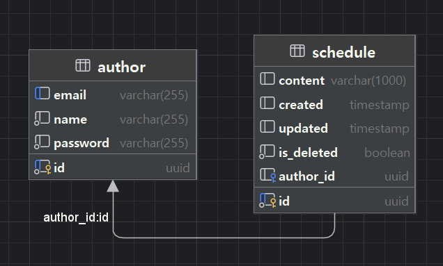

# ⏰ Scheduller with Spring JDBC

## 📜프로젝트 파일 구조
```java
📁com.schedule
├── 📁common
│   ├── 📁config
│   │   ├── AppConfig
│   │   ├── JacksonConfig
│   │   ├── SecurityConfig
│   │   ├── SwaggerConfig
│   │   └── TransactionConfig
│   ├── 📁database
│   │   ├── DatabaseConnection
│   │   └── DatabaseExceptionHandler
│   └── 📁exception
│       ├── BaseException
│       ├── CustomException
│       ├── CustomSQLException
│       ├── ErrorCode
│       ├── GlobalExceptionHandler
│       └── SQLErrorCode
├── 📁controller
│   ├── 📁author
│   │   ├──📁controller
│   │   │   └── AuthorController
│   │   ├── 📁dao
│   │   │   └── AuthorDao
│   │   ├── 📁dto
│   │   │   ├── AuthorMapper
│   │   │   ├── AuthorRequestDto
│   │   │   ├── AuthorResponseDto
│   │   │   ├── CombinedAuthorRequestDto
│   │   │   └── PasswordRequestDto
│   │   ├── 📁model
│   │   │   └── Author
│   │   └── 📁service
│   │       ├── AuthorCRUDService
│   │       └── AuthorValidationService
│   └── 📁schedule
│       ├── 📁controller
│       │   └── ScheduleController
│       ├── 📁dao
│       │   ├── ScheduleDao
│       │   └── ScheduleMapper
│       ├── 📁dto
│       │   ├── ScheduleRequestDto
│       │   └── ScheduleResponseDto
│       ├── 📁model
│       │   └── Schedule
│       └── 📁service
│           ├── ScheduleCRUDService
│           ├── SchedulePagingService
│           └── ServiceValidationService
└── ScheduleApplication


```
- 사용 언어 : JAVA
- 구현된 기능 : 스케줄 crud, paging / 작성자 crud

## ⭐ ERD


## ⭐ API 명세서


### Author 관련 API

| 기능      | Method | URL                          | Request       | Response     | 상태코드      |
|-----------|--------|------------------------------|---------------|--------------|-----------|
| Author 등록 | POST   | `/authors`                  | 등록 정보 Body | 등록 정보    | 200: 정상등록 |
| Author 조회 | GET    | `/authors/{authorId}`       | Path Param    | Author 정보  | 200: 정상조회 |
| Author 수정 | POST   | `/authors/{authorId}/update`| 수정 정보 Body | 수정 정보    | 200: 정상수정 |
| Author 삭제 | POST   | `/authors/{authorId}/delete`| Path Param + Body | 삭제완료   | 204: 정상삭제 |

### Schedule 관련 API

| 기능      | Method | URL                          | Request       | Response    | 상태코드      |
|-----------|--------|------------------------------|---------------|-------------|-----------|
| Schedule 등록 | POST   | `/schedules`               | 등록 정보 Body | 등록된 정보      | 200: 정상등록 |
| Schedule 조회 | GET    | `/schedules/{scheduleId}`  | Path Param    | Schedule 정보 | 200: 정상조회 |
| Schedule 수정 | POST   | `/schedules/{scheduleId}/update`| 수정 정보 Body + Header (authorPassword) | 수정된 정보      | 200: 정상수정 |
| Schedule 삭제 | POST   | `/schedules/{scheduleId}/delete`| Path Param + Body | 삭제완료        | 204: 정상삭제 |
| Schedule 목록 조회 | GET    | `/schedules`            | Query Params (authorName, date, page, size) | Schedule 목록 | 200: 정상조회 |

<details><summary>상세보기
</summary>

## Author 관련 API

### 1. Author 등록
- **Method:** POST
- **URL:** `/authors`
- **Request Body:**
  ```json
  {
    "name": "string",
    "email": "string",
    "password": "string"
  }
  ```
- **Response:**
  - **Status Code:** 200 OK
  - **Response Body:**
    ```json
    {
      "id": "UUID",
      "name": "string",
      "email": "string"
    }
    ```

### 2. Author 조회
- **Method:** GET
- **URL:** `/authors/{authorId}`
- **Path Parameters:**
  - `authorId` (string, required): Author의 UUID.
- **Response:**
  - **Status Code:** 200 OK
  - **Response Body:**
    ```json
    {
      "id": "UUID",
      "name": "string",
      "email": "string"
    }
    ```

### 3. Author 수정
- **Method:** POST
- **URL:** `/authors/{authorId}/update`
- **Path Parameters:**
  - `authorId` (string, required): Author의 UUID.
- **Request Body:**
  ```json
  {
    "name": "string",
    "email": "string",
    "password": "string"
  },
  {
    "password": "string"
  }
  ```
- **Response:**
  - **Status Code:** 200 OK
  - **Response Body:**
    ```json
    {
      "id": "UUID",
      "name": "string",
      "email": "string"
    }
    ```

### 4. Author 삭제
- **Method:** POST
- **URL:** `/authors/{authorId}/delete`
- **Path Parameters:**
  - `authorId` (string, required): Author의 UUID.
- **Request Body:**
  ```json
  {
    "password": "string"
  }
  ```
- **Response:**
  - **Status Code:** 204 No Content

---

## Schedule 관련 API

### 1. Schedule 등록
- **Method:** POST
- **URL:** `/schedules`
- **Request Body:**
  ```json
  {
    "authorId": "UUID",
    "content": "string"
  }
  ```
- **Response:**
  - **Status Code:** 200 OK
  - **Response Body:**
    ```json
    {
      "scheduleId": "UUID",
      "authorId": "UUID",
      "content": "string",
      "created": "2024-12-09T12:00:00Z",
      "updated": "2024-12-09T12:00:00Z"
    }
    ```

### 2. Schedule 조회
- **Method:** GET
- **URL:** `/schedules/{scheduleId}`
- **Path Parameters:**
  - `scheduleId` (string, required): Schedule의 UUID.
- **Response:**
  - **Status Code:** 200 OK
  - **Response Body:**
    ```json
    {
      "scheduleId": "UUID",
      "authorId": "UUID",
      "content": "string",
      "created": "2024-12-09T12:00:00Z",
      "updated": "2024-12-09T12:00:00Z"
    }
    ```

### 3. Schedule 수정
- **Method:** POST
- **URL:** `/schedules/{scheduleId}/update`
- **Path Parameters:**
  - `scheduleId` (string, required): Schedule의 UUID.
- **Request Headers:**
  - `authorPassword` (string, required): Author의 패스워드.
- **Request Body:**
  ```json
  {
    "content": "string"
  }
  ```
- **Response:**
  - **Status Code:** 200 OK
  - **Response Body:**
    ```json
    {
      "scheduleId": "UUID",
      "authorId": "UUID",
      "content": "string",
      "created": "2024-12-09T12:00:00Z",
      "updated": "2024-12-09T12:00:00Z"
    }
    ```

### 4. Schedule 삭제
- **Method:** POST
- **URL:** `/schedules/{scheduleId}/delete`
- **Path Parameters:**
  - `scheduleId` (string, required): Schedule의 UUID.
- **Request Body:**
  ```json
  {
    "password": "string"
  }
  ```
- **Response:**
  - **Status Code:** 204 No Content

### 5. Schedule 목록 조회
- **Method:** GET
- **URL:** `/schedules`
- **Query Parameters:**
  - `authorName` (string, optional): Author 이름.
  - `date` (string, optional): 특정 날짜 (YYYY-MM-DD).
  - `page` (integer, required): 페이지 번호.
  - `size` (integer, required): 한 페이지에 표시할 Schedule 개수.
- **Response:**
  - **Status Code:** 200 OK
  - **Response Body:**
    ```json
    [
      {
        "scheduleId": "UUID",
        "authorId": "UUID",
        "content": "string",
        "created": "2024-12-09T12:00:00Z",
        "updated": "2024-12-09T12:00:00Z"
      }
    ]
    ```


</details>


## ⭐ 유지 보수가 편리한 스케줄러를 만들었습니다!
1. 책임 분리 원칙을 따르도록 리팩토링 했습니다.

2. 예외 클래스에 추상화를 적용하여 확장성을 높였습니다.

3. 클래스, 메서드 네이밍을 확실히 했습니다.

4. 에러코드를 enum으로 관리하며 예외 처리를 확실하게 했습니다.


## 🗨️최대한 많이 배우려고 노력했습니다!
1. transaction, resttemplate, mapper class 등 낯선 기능들을 공부하며 써보려 노력했습니다.

2. SOLID 원칙에 따라 리팩토링을 열심히 했습니다.


## 🛠 앞으로 개선하고 싶은 점도 많습니다.

1. entity-dto-dao 간의 변환과정에 새로운 entity가 추가되거나 join을 사용해야된다면 수정해야될 부분이 많은데, 어떻게 해소할지 고민입니다.

2. 메인 crud 기능의 간소화보단 예외처리, 리팩토링에 더 신경쓰게 된 점이 아쉽습니다.


## ⌨️ 내가 고민했던 것들

- [
  일정 관리 앱 프로젝트 시작](https://roqkfchqh.tistory.com/93)
- [
  Lv1, Lv2](https://roqkfchqh.tistory.com/94)

- [
  트러블슈팅 : 필수과제 버그 수정](https://roqkfchqh.tistory.com/96)

- [
  (도전과제 시작) author 테이블 만들기, custom exception 추가](https://roqkfchqh.tistory.com/97)

- [
  도전과제 과정](https://roqkfchqh.tistory.com/101)
****